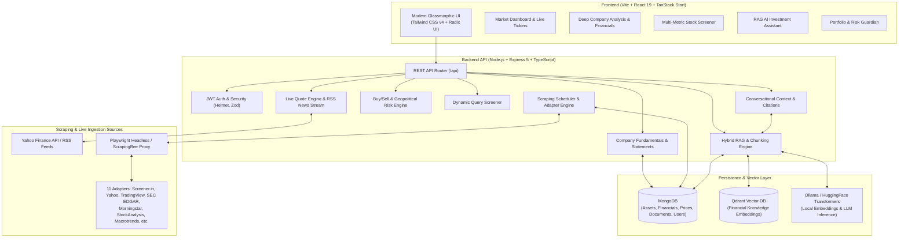

# 🧠 AssetMind AI

> **Next-Generation Autonomous Investment Intelligence, Real-Time Market Analytics & RAG-Powered Financial Assistant**

[](https://www.typescriptlang.org/)
[](https://react.dev/)
[](https://nodejs.org/)
[](https://expressjs.com/)
[](https://www.mongodb.com/)
[](https://qdrant.tech/)
[](https://tailwindcss.com/)
[](https://opensource.org/licenses/ISC)

---

## 🌟 Executive Overview

**AssetMind AI** is an enterprise-grade financial intelligence and wealth analytics platform that combines **real-time market data streaming**, **multi-source autonomous web scraping**, **deep quantitative valuation models**, and **Retrieval-Augmented Generation (RAG) AI** into a unified, high-performance web experience.

Designed for investors, analysts, and wealth managers, AssetMind AI ingests and cross-validates structured and unstructured data from over 11 global and regional financial data providers, normalizes company fundamentals, evaluates geopolitical and buy/sell risk signals, and empowers users with a context-grounded conversational AI assistant backed by local vector embeddings and LLMs.

---

## 🏗️ System Architecture



---

## ⚡ Core Capabilities & Key Features

### 1. 📊 Real-Time Market Engine & Live News Feeds
- **High-Frequency Quote Tracking**: Sub-60s automated refresh using Yahoo Finance API V8 for Indian (`.NS`, `.BO`) and global equities.
- **Aggregated Financial News**: Multi-channel RSS news pipeline aggregating Yahoo Finance, Google News, The Economic Times, and LiveMint with symbol-level entity extraction and sentiment tagging.
- **Server-Sent Events (SSE)**: Live streaming price tickers directly into frontend charts and indicators.

### 2. 🕷️ Multi-Source Scraping & Data Harmonization Engine
- **11 Modular Source Adapters**:
  - [Screener.in](https://www.screener.in/) (Indian balance sheets, P&L, quarterly results, ratios)
  - [Yahoo Finance](https://finance.yahoo.com/) (Overview, statistics, valuation)
  - [StockAnalysis.com](https://stockanalysis.com/) (Detailed multi-year financials)
  - [MarketScreener](https://www.marketscreener.com/) (Consensus estimates, analyst ratings)
  - [Macrotrends](https://www.macrotrends.net/) (Long-term historical price & revenue trends)
  - [CompaniesMarketCap](https://companiesmarketcap.com/) (Global ranking & market cap)
  - [TradingView](https://www.tradingview.com/) (Technical indicators, oscillators)
  - [Investing.com](https://www.investing.com/) (Macro indicators & company metrics)
  - [Morningstar](https://www.morningstar.com/) (Moat ratings, valuation metrics)
  - [SEC EDGAR](https://www.sec.gov/edgar/) (Official 10-K, 10-Q regulatory filings)
  - [StockMarketCap](https://get.stockmarketcap.io/) (Fast valuation snapshots)
- **Dual Execution Engine**:
  - **Playwright**: Headless Chromium automation with anti-bot evasion and dynamic JavaScript execution.
  - **ScrapingBee API**: Proxy-rotated fallback scraper.
- **Data Validation & Normalization Pipeline**:
  - Intelligent multiplier parser (`$3.45T`, `185.2B`, `₹45,000 Cr`, negative brackets, percentage cleanups).
  - Standardized camelCase metric normalization across disparate accounting conventions.
  - Deduplication and sanity checking ensuring zero hallucinated metrics.

### 3. 🧠 Hybrid RAG AI Investment Copilot
- **Semantic Vector Storage**: High-speed similarity indexing with [Qdrant](https://qdrant.tech/).
- **On-Device Embeddings**: Built-in `@xenova/transformers` (all-MiniLM-L6-v2) for zero-latency local vectorization.
- **Hybrid Retrieval & Reranking**: Combines dense semantic vector search with sparse keyword lexical search, followed by cross-encoder re-ranking for pinpoint precision.
- **Local / Self-Hosted LLMs**: Native integration with [Ollama](https://ollama.ai/) (`gpt-oss:20b-cloud`, `llama3`, `mistral`, etc.) ensuring strict privacy of sensitive portfolio data.
- **Audit-Ready Citations**: Generates answers with exact source links to company filings, quarterly disclosures, and scraped financial statements.

### 4. 📈 Quantitative Analysis & Risk Sentinel
- **Automated Buy/Sell Evaluation**: Multi-dimensional scoring evaluating valuation (P/E, EV/EBITDA, P/B), balance sheet health (Debt/Equity, Current Ratio), cash generation (FCF yield, ROE, ROCE), and growth momentum.
- **Geopolitical & Supply Chain Risk Sentinel**: Natural language analysis of news and macro risks affecting specific company operations and sector dependencies.
- **Risk Sentinel ("Guardian")**: Portfolio risk alerts, concentration checks, and volatility warnings.

### 5. 🔍 Advanced Stock Screener
- Live search and multi-metric filter engine over market cap, P/E ratio, ROCE, ROE, debt-to-equity, dividend yield, sector, and industry.
- Instant on-demand scraping trigger if a searched ticker is not yet present in the local database.

### 6. 💼 Comprehensive Personal Wealth Suite
- **Portfolio & Watchlist Tracking**: Live P&L, allocation breakdown, and price change alerts.
- **Multi-Asset Management**: Stocks, mutual funds, cash/bank accounts, insurance, and net worth overview.
- **Budgeting & Expense Intelligence**: Cashflow tracking and expense categorization.

---

## 🛠️ Technology Stack

| Domain | Technologies |
|---|---|
| **Frontend Framework** | React 19, TanStack Start, TanStack Router, TanStack Query |
| **Frontend Styling** | Tailwind CSS v4, Radix UI Primitives, Lucide Icons, Class Variance Authority |
| **Data Visualization** | Recharts (Financial charts, price history, ratios) |
| **Backend Runtime** | Node.js (v20+), TypeScript, `tsx` engine |
| **Web Server** | Express.js 5, Helmet, CORS, RESTful API Architecture |
| **Primary Database** | MongoDB Community / Atlas with Mongoose ODM |
| **Vector Database** | Qdrant Vector Search Engine (REST API Client) |
| **Embeddings & AI** | `@xenova/transformers`, Ollama LLM API, Custom RAG Pipeline |
| **Web Scraping** | Playwright (Headless Browser), Cheerio, Axios, ScrapingBee |
| **Authentication** | Stateless JWT (JSON Web Tokens), bcryptjs password hashing |
| **Validation** | Zod schema validation across all inputs |
| **Task Scheduling** | `node-cron` (automated scraping, live quotes refresh) |

---

## 📁 Repository Structure

```
AssetMind-AI/
├── backend/                       # Node.js + TypeScript Express Backend
│   ├── src/
│   │   ├── config/                # Database connections, env parser
│   │   ├── middleware/            # JWT authentication, error & 404 handlers
│   │   ├── models/                # Mongoose schemas (Asset, FinancialData, User, etc.)
│   │   ├── modules/
│   │   │   ├── analysis/          # Buy/Sell scoring, geopolitical risk engine
│   │   │   ├── auth/              # User signup, login, JWT issuance, profile
│   │   │   ├── chat/              # Chat sessions, RAG conversational orchestrator
│   │   │   ├── companies/         # Company profiles, price history, financials
│   │   │   ├── quality/           # Data normalization, deduplication, quality score
│   │   │   ├── rag/               # Document chunking, embeddings, Qdrant sync, reranking
│   │   │   ├── realtime/          # Yahoo v8 live quotes, RSS news ingestion, scheduler
│   │   │   ├── scraping/          # 11 source adapters, Playwright & ScrapingBee engines
│   │   │   ├── screener/          # Stock screener queries, live search & on-demand scrape
│   │   │   └── stocks/            # Core stock REST endpoints & metadata
│   │   ├── routes/                # Master API index (/api)
│   │   ├── scripts/               # Seeding, market crawl, RAG sync, database maintenance
│   │   ├── tests/                 # End-to-end integration & automated test suites
│   │   ├── utils/                 # Standard API response & error formatters
│   │   ├── app.ts                 # Express app configuration & middleware
│   │   └── server.ts              # HTTP server bootstrapper & cron lifecycle
│   ├── .env.example               # Backend environment variable reference template
│   ├── package.json               # Backend dependencies & npm scripts
│   └── tsconfig.json              # TypeScript compilation configuration
│
├── frontend/                      # React 19 + TanStack Start Frontend
│   ├── src/
│   │   ├── components/            # UI components (Radix primitives, layout, dialogs)
│   │   ├── hooks/                 # Custom React hooks
│   │   ├── lib/                   # API client (Axios/fetch), formatters, market data
│   │   ├── routes/                # TanStack file-based routes
│   │   │   ├── index.tsx          # Main market dashboard
│   │   │   ├── company.$ticker.tsx# Detailed stock research page
│   │   │   ├── research.tsx       # Screener & comparative analysis
│   │   │   ├── portfolio.tsx      # Portfolio management
│   │   │   ├── watchlist.tsx      # Stock watchlist
│   │   │   ├── guardian.tsx       # AI risk guardian
│   │   │   ├── budget.tsx         # Cashflow & budget planner
│   │   │   ├── mutual-funds.tsx   # Mutual funds tracker
│   │   │   ├── insurance.tsx      # Insurance tracker
│   │   │   ├── assets.tsx         # Net worth assets tracker
│   │   │   ├── settings.tsx       # App & account settings
│   │   │   └── login.tsx          # User authentication page
│   │   ├── App.tsx                # App root wrapper
│   │   └── router.tsx             # TanStack router setup
│   ├── .env.example               # Frontend environment variable reference template
│   ├── package.json               # Frontend dependencies & npm scripts
│   ├── vite.config.ts             # Vite configuration with TanStack Start
│   └── tsconfig.json              # Frontend TypeScript configuration
│
├── .gitignore                     # Git ignore rules for node_modules, .env, build output
└── README.md                      # Project documentation (this file)
```

---

## 🚀 Quick Start Guide

### Prerequisites

Ensure you have the following installed on your machine:
- **Node.js**: v20.x or higher
- **npm** or **pnpm** / **bun**
- **MongoDB**: Community Edition running locally (`mongodb://127.0.0.1:27017`) or a MongoDB Atlas URI
- *(Optional for RAG)* **Qdrant Vector Database**: Running on `http://localhost:6333` (e.g. via Docker: `docker run -p 6333:6333 qdrant/qdrant`)
- *(Optional for Local LLM)* **Ollama**: Running on `http://localhost:11434`

---

### Step 1: Clone the Repository

```bash
git clone https://github.com/Ashithdeveloper/AssetMind-AI.git
cd AssetMind-AI
```

---

### Step 2: Backend Configuration & Startup

1. **Navigate to the backend directory and install dependencies**:
   ```bash
   cd backend
   npm install
   ```

2. **Initialize Playwright browsers** (for headless web scraping):
   ```bash
   npx playwright install chromium
   ```

3. **Configure environment variables**:
   ```bash
   # On macOS/Linux:
   cp .env.example .env

   # On Windows PowerShell:
   Copy-Item .env.example .env
   ```
   *(Refer to `.env.example` for all configurable environment variables).*

4. **Seed initial company data & sync RAG knowledge base** *(Optional)*:
   ```bash
   npm run seed:companies    # Seeds 80+ top companies into MongoDB
   npm run sync:rag          # Chunks documents and vectorizes into Qdrant
   ```

5. **Launch the backend in development mode**:
   ```bash
   npm run dev
   ```
   *The server starts on `http://localhost:5000`.*

---

### Step 3: Frontend Configuration & Startup

1. **Open a new terminal, navigate to the frontend directory, and install dependencies**:
   ```bash
   cd frontend
   npm install
   ```

2. **Configure frontend environment variables**:
   ```bash
   # On macOS/Linux:
   cp .env.example .env

   # On Windows PowerShell:
   Copy-Item .env.example .env
   ```
   *The default `VITE_API_BASE_URL` is configured to `http://localhost:5000/api`.*

3. **Launch the frontend development server**:
   ```bash
   npm run dev
   ```
   *Open the URL shown in the terminal (typically `http://localhost:8080` or `http://localhost:5173`) in your browser.*

---

## 📡 API Reference Overview

The backend exposes a structured RESTful API under `/api`. Below is a summary of the core modules:

### 🛡️ Authentication (`/api/auth`)
| Method | Endpoint | Description | Auth Required |
|---|---|---|---|
| `POST` | `/api/auth/register` | Register new user account | No |
| `POST` | `/api/auth/login` | Log in and receive JWT token | No |
| `GET` | `/api/auth/me` | Fetch authenticated user profile | Yes (Bearer) |
| `POST` | `/api/auth/logout` | Invalidate/logout user session | No |

### 🏢 Companies & Fundamentals (`/api/companies`)
| Method | Endpoint | Description | Auth Required |
|---|---|---|---|
| `GET` | `/api/companies` / `/explore` | Paginated company explorer with sector aggregation | No |
| `GET` | `/api/companies/search?q=` | Fast fuzzy search by name or symbol | No |
| `GET` | `/api/companies/:symbol` | Full company profile, metrics, latest reporting | No |
| `GET` | `/api/companies/:symbol/price-history` | Historical OHLCV stock price history | No |
| `GET` | `/api/companies/:symbol/financials` | Normalized canonical financial metrics | No |
| `GET` | `/api/companies/:symbol/statements` | Formatted multi-year Income, Balance Sheet, Cash Flow | No |
| `POST` | `/api/companies/:symbol/refresh` | Force on-demand re-scrape of company data | No |

### ⚡ Real-Time Market & News (`/api/realtime`)
| Method | Endpoint | Description | Auth Required |
|---|---|---|---|
| `GET` | `/api/realtime/quotes/snapshot` | Snapshot of all tracked equity live quotes | No |
| `GET` | `/api/realtime/market/news` | Aggregated live financial news stream | No |
| `GET` | `/api/realtime/market/indices` | Major market indices overview (Nifty, Sensex, etc.) | No |
| `GET` | `/api/realtime/:symbol/quote` | Live quote with bid, ask, day change, volume | No |
| `GET` | `/api/realtime/:symbol/news` | Company-specific news headlines | No |
| `GET` | `/api/realtime/:symbol/news-analysis`| Sentiment and impact breakdown of recent news | No |
| `GET` | `/api/realtime/:symbol/stream` | Server-Sent Events (SSE) live price updates | No |
| `POST` | `/api/realtime/refresh` | Trigger manual price refresh cycle | No |

### 🤖 RAG Vector & Knowledge (`/api/rag`)
| Method | Endpoint | Description | Auth Required |
|---|---|---|---|
| `POST` | `/api/rag/index` | Chunk & index specific company documents into Qdrant | No |
| `POST` | `/api/rag/reindex` | Full re-indexing of all available financial documents | No |
| `POST` | `/api/rag/search` | Semantic vector search for evidence passages | No |
| `POST` | `/api/rag/query` | RAG query returning grounded AI answer with citations | No |
| `GET` | `/api/rag/stats` | Qdrant collection statistics and vector count | No |

### 💬 Conversational AI (`/api/chat`)
| Method | Endpoint | Description | Auth Required |
|---|---|---|---|
| `POST` | `/api/chat/message` | Send message to AI financial analyst (with RAG grounding) | No |
| `GET` | `/api/chat/sessions` | List active user chat sessions | No |
| `GET` | `/api/chat/sessions/:id/messages` | Retrieve conversation history for a session | No |
| `DELETE`| `/api/chat/sessions/:id` | Delete chat session | No |

### 📊 Buy/Sell Analysis & Risk (`/api/analysis`)
| Method | Endpoint | Description | Auth Required |
|---|---|---|---|
| `POST` | `/api/analysis/:symbol/buy` | Compute multi-factor Buy analysis & target price | Optional |
| `POST` | `/api/analysis/:symbol/sell` | Compute Sell assessment & exit warning indicators | Optional |
| `GET` | `/api/analysis/reports` | Get user's saved analysis reports | Optional |
| `GET` | `/api/analysis/reports/:id` | View specific analysis report | Optional |

### 🔍 Stock Screener (`/api/screener`)
| Method | Endpoint | Description | Auth Required |
|---|---|---|---|
| `GET` | `/api/screener/search?q=` | Live search Screener.in autocomplete | No |
| `POST` | `/api/screener/scrape` | On-demand scrape and ingestion from Screener.in | No |
| `GET` | `/api/screener/company/:symbol`| Instant screener fundamentals fetch | No |

### 🕷️ Scraping Administration (`/api/scraping`)
| Method | Endpoint | Description | Auth Required |
|---|---|---|---|
| `GET` | `/api/scraping/sources` | List all 11 supported scraping source adapters | No |
| `POST` | `/api/scraping/stocks` | Initiate scraping job for specified symbols & sources | Yes (Bearer) |
| `GET` | `/api/scraping/jobs` | Historical list of scraping jobs | Yes (Bearer) |
| `GET` | `/api/scraping/jobs/:jobId` | Detailed status, progress & results of a scraping job | Yes (Bearer) |

---

## 🧪 Testing & Maintenance Scripts

The backend includes a rich suite of CLI scripts for automated testing, data seeding, and database operations:

```bash
# Run all automated test suites (Auth, Scraping, Models, APIs)
npm test

# Run RAG vector retrieval & embedding tests
npm run test:rag

# Test deep financial analysis & company explore logic
npm run test:explore

# Test Indian equity scraping & normalization
npm run test:india

# Execute full end-to-end demo workflow
npm run demo

# Sync and vectorize all company data to Qdrant Vector DB
npm run sync:rag

# Seed 80+ top companies into the database
npm run seed:companies

# Scrape Indian companies from Screener.in
npm run scrape:india

# Enrich existing company records with multi-source fundamentals
npm run enrich:companies

# Crawl live market prices and updates
npm run crawl:market

# Check database collection counts & statistics
npm run db:stats

# Clean up / remove global companies if focusing strictly on Indian markets
npm run db:purge-global
```

---

## 🔒 Security & Best Practices

- **Zero-Storage of Sensitive Plaintext**: Passwords salted with bcrypt (10 rounds); API keys and credentials isolated in `.env` files (never committed to version control).
- **Header Hardening**: Pre-configured `Helmet` middleware enforcing secure HTTP response headers and Content Security Policies.
- **CORS Restricted**: Controlled origin handling for frontend client origins.
- **Fail-Safe Web Scraping**: Headless browsers operate with random user agents, respectful request pacing, and sandboxed page contexts.

---

## 🤝 Contributing

Contributions to AssetMind AI are warmly welcome! Please adhere to the following workflow:

1. **Fork the repository** on GitHub.
2. **Create a feature branch**:
   ```bash
   git checkout -b feature/my-new-feature
   ```
3. **Commit your changes**:
   ```bash
   git commit -m "feat(screener): add custom momentum filter"
   ```
4. **Push to the branch**:
   ```bash
   git push origin feature/my-new-feature
   ```
5. **Open a Pull Request** describing your additions and changes.

---

## 📄 License

This project is licensed under the [ISC License](LICENSE).
